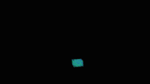

# Spiraling Sphere

Inspiration: http://sprott.physics.wisc.edu/pubs/paper423.pdf

<-Initial
<-Final

I wanted to create a system that formed a spiraling sphere to resemble my inspiration of a sci-fi hollow earth with an entry way through its core or the abstract depiction of the gateway to the underworld from Dante’s Inferno.

To achieve this, I used the formula from a chaotic system known as Sprott Attractor.
Thanks to its simplicity, it was easy to code in its parameters to produce the desired behavior.
```
x = y + 2xy + xz
y = 1 - 2x^2 + yz
z = x - x^2 - y^2
```
